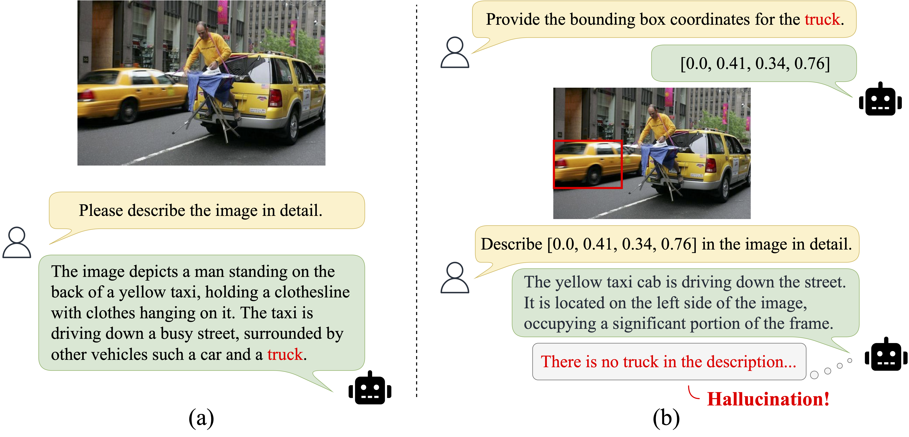

<div align="center">

<h1>R-CoV: Region-Aware Chain-of-Verification for Alleviating Object Hallucinations in LVLMs</h1>

<div>
    <a href='https://jiahao000.github.io/' target='_blank'>Jiahao Xie</a><sup>1,2</sup>&emsp;
    <a href='https://alessiotonioni.github.io/' target='_blank'>Alessio Tonioni</a><sup>3</sup>&emsp;
    <a href='https://scholar.google.com/citations?user=OglqhoUAAAAJ&hl=en' target='_blank'>Nathalie Rauschmayr</a><sup>3</sup>&emsp;
    <a href='https://federicotombari.github.io/' target='_blank'>Federico Tombari</a><sup>3</sup>&emsp;
    <a href='https://scholar.google.com/citations?user=z76PBfYAAAAJ&hl=en' target='_blank'>Bernt Schiele</a><sup>1,2</sup>
</div>
<div>
    <sup>1</sup>Max Planck Institute for Informatics&emsp;
    <sup>2</sup>VIA Research Center&emsp;
    <sup>3</sup>Google
</div>

<div>
    <h4 align="center">
        <a href="https://arxiv.org/abs/2604.20696" target='_blank'>
        
        </a>
        <a href="https://github.com/Jiahao000/R-CoV" target='_blank'>
        
        </a>
        <a href="https://github.com/Jiahao000/R-CoV#-citation" target='_blank'>
        
        </a>
    </h4>
</div>

<strong>We present R-CoV, a visual chain-of-verification method that triggers region-level processing from LVLMs themselves to alleviate their own hallucinations. R-CoV mimics how humans comprehend intricate visual information by delving into details in specific image regions. R-CoV can be seamlessly applied to various LVLMs without retraining or relying on external detection models.</strong>

<div style="text-align:center">

</div>

🤩 <ins>Key Properties</ins>

<html>
    <table style="margin-left: auto; margin-right: auto;">
        <tr>
            <td>
                <li>Training-free and plug-and-play</li> 
                <li>Without accessing internal model parameters</li>
                <li>Without relying on external detection models</li>
            </td>
        </tr>
    </table>
</html>

📖 For more results, please refer to our <a href="https://arxiv.org/abs/2604.20696" target="_blank">paper</a>

---

</div>

## 🔔 News
- [04/2026] 🔥 R-CoV is released on [arXiv](https://arxiv.org/abs/2604.20696).

## 🌟 Method

R-CoV is a <i>training-free post-hoc correction</i> method to alleviate object hallucinations in LVLMs. It consists of six stages: initial response generation, entity extraction, coordinate generation, region description, verification execution, and final response generation.

<div style="text-align:center">

</div>

## 🤗 Qualitative Examples

We present some qualitative results, including two types of questions: (a) yes-or-no questions, and (b) open-ended questions.

### Yes-or-No Questions

<div style="text-align:center">

</div>


### Open-Ended Questions

<div style="text-align:center">

</div>

## 🔗 Citation

If you find this work useful for your research, please consider citing our paper:

```bibtex
@article{xie2026rcov,
  title = {R-CoV: Region-Aware Chain-of-Verification for Alleviating Object Hallucinations in LVLMs},
  author = {Xie, Jiahao and Tonioni, Alessio and Rauschmayr, Nathalie and Tombari, Federico and Schiele, Bernt},
  journal = {arXiv preprint arXiv:2604.20696},
  year = {2026}
}
```
